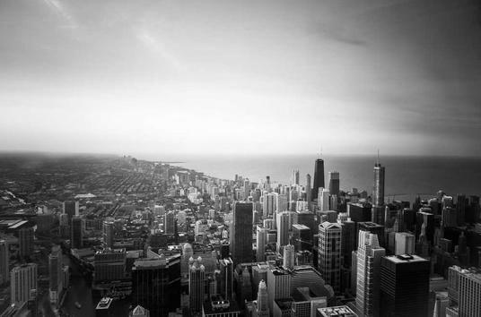

# CUDA - konvertovanie RGB obrázka na grayscale

## Popis

Úlohou tohto zadania je implementovať program, ktorý pomocou gpu konvertuje RGB obrázok na grayscale.
Body zadania: 
* Načítať obrázok vo formáte jpg, konvertovať ho na grayscale s
použitím GPU a zapísať do nového súboru.
* Načítať obrázok vo formáte jpg, konvertovať ho na grayscale s
použitím CPU a zapísať do nového súboru.
* Konvertovať väčšie množstvo obrázkov oboma metódami. Zaznamenať si primerný čas konverzie

## Inštalácia

Program je implementovaný v jazyku Python 3.10. Pre implementáciu zadania boli použité viaceré knižnice:
* numpy 1.23.5
* pillow 9.4.0
* numba 0.57.0

## Vysvetlenie

Na riadku 16 je definovaná kernel funkcia pre konvertovanie RGB obrázka do grayscale. Vstupom do funkcie je 
RGB obrázok vo formáte (výška, šírka, 3). Posledná dimenzia reprezentuje zložky červenej, zelenej a modrej farby. 
Na riadku 24 funkcia **cuda.grid(2)** zistí súradnice pixelu, ktorému je pridelený aktuálny CUDA thread. 
V if podmienke sa overuje, či sa súradnice pixelu nechádzajú v rozmedzi veľkosti dátového poľa **rgb_array**. Ak áno tak 
sa na dané súradnice do poľa **gray_array** zapíše hodnota na prevod rgb pixela do gray scale podľa vzorca 
0.2989 * R + 0.5870 * G + 0.1140 * B.

Funkcia **cpu_convert()** konvertuje obrázok do grayscale s použitím CPU. Prechádza postupne obrázky, ktoré sa nachádzajú 
v priečinku. Následne sa vo for cykle vyberajú pixely z RGB obrázka a repočítava sa hodnota pixelu v novom obrázku 
pomocou vzorca. Keď sa prejdú všetky pixely uloží sa konvertovaný obrázok.

Na 54 riadku je definovaná funkcia **gpu_convert()** V tejto funkcii sa tiež postupne prechádzajú obrázky v priečinku. 
Na riadku 67 sa vytorí nové pole s rozmermi pôvodného obrázka. Na riadku 69 si určíme počet vlákien v bloku na 16 v oboch smeroch. 
Potom si vypočítame koľko blokov bude potrebných na celkový výpočet ako súčet rozmeru obrázka a rozmeru vlákien v bloku mínus jeden. Následne
dané číslo celočíselne podelíme s rozmermi vlákien v bloku. Na riadku 73 zavoláme kernel funkciu do ktorej musíme ešte zadať  
vypočítané rozmery blokov v gride a vlákien v bloku. Nakoniec výsledný obrázok uložíme do priečinka.

## Ukážka výsledkov

